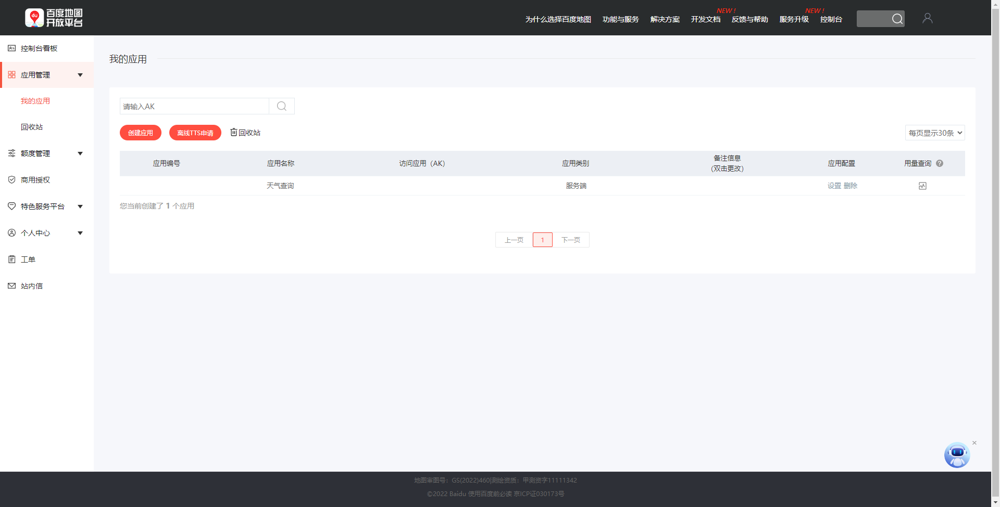
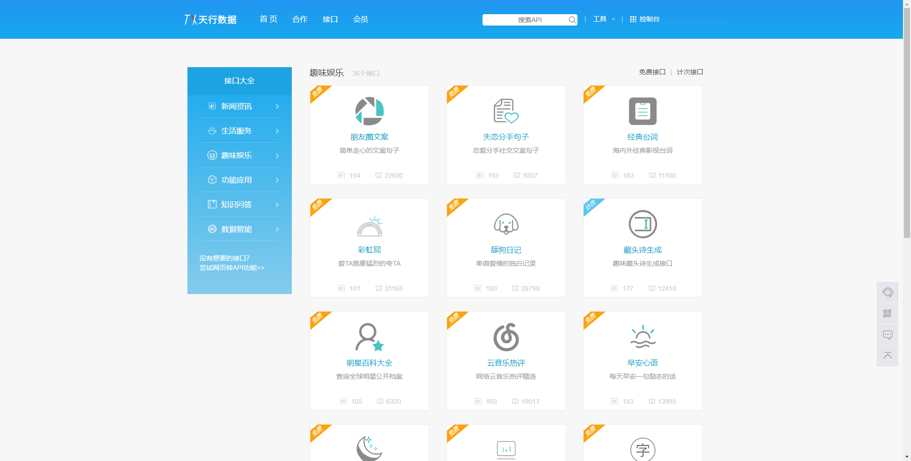
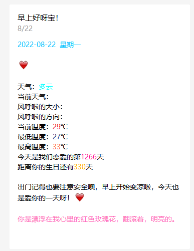

## 项目简介
---
在这里做一个简单的介绍，这里使用的是微信公众号测试号，正式的功能则会更多，大家可以自由发挥。

## 功能介绍
---
- 通过Spring自带的定时器Scheduled制作定时任务，实现定时推送自定义贴心早安语
- 通过第三方接口丰富推送的消息内容
    - 百度天气api：添加天气信息推送
    - 天行数据api：添加美句、彩虹屁等语句推送
    - 通过后台计算纪念日推送
- 可实现批量群发，但受测试号限制最多只能十人

## 运行介绍
---
这里提前列举一下本机的运行环境：
- Java：1.8
- Spring Boot： 2.3.7.RELEASE
- Maven：3.8.1

下面则是对简单运行起来的步骤介绍
1. 将项目克隆到本地，并将其导入到Java的IDE中，如IDEA；
2. 通过[微信公众平台](https://mp.weixin.qq.com/debug/cgi-bin/sandbox?t=sandbox/login)获取微信公众号测试号；
3. 进入微信公众测试号之后往下滑找到 **模板消息接口** ，新建自己的模板，这里提供我的模板供大家参考：

```text
模板标题：早上好呀！

模板内容：
{{riqi.DATA}} 

{{beizhu.DATA}} 

天气：{{tianqi.DATA}} 
当前天气：{{text_now.DATA}} 
风力大小：{{wind_class.DATA}} 
风向：{{wind_dir.DATA}} 
当前温度：{{temp.DATA}}℃ 
最低温度：{{low.DATA}}℃ 
最高温度：{{high.DATA}}℃ 
今天是我们恋爱的第{{lianai.DATA}}天 
距离你的生日还有{{shengri.DATA}}天 
{{caihongpi.DATA}}
```
4. 注册后进入百度地图开放平台的控制台的应用管理 -> 我的应用 -> 创建应用（其中IP白名单选择0.0.0.0/0），这里是为了拿到AK码



5. 进入到[天行数据](https://www.tianapi.com/list/)中挑选喜欢的API进行申请，这里推荐的是彩虹屁和土味情话，当然也可以其他的。主要是为了拿到接口的key

6. 按照application-template.yml里面的模板将自己的信息往里填，所有的数据都能在上面的步骤中拿到，其余的就是你们的私密信息了
7. 定时默认的是每天6：30分，可前往 **top.xbaoziplus.weixinpush.weixinpush.config.TaskConfig** 自行修改
## 结果演示
到这里将项目运行起来，就能在设定时间内接收到公众号的消息推送啦。另外为了可以及时测试，在测试类中有各个工具类以及整体推送的测试方法，以及编写了两个Rest接口，可以直接使用Postman或浏览器直接请求API进行推送，其中一个接口中的参数是替换掉彩虹屁的文字的，可以自定义语录进行传参。



> 最后提一嘴，这里如果需要部署的话自己使用服务器部署就行，我是直接宝塔丢上去的。


